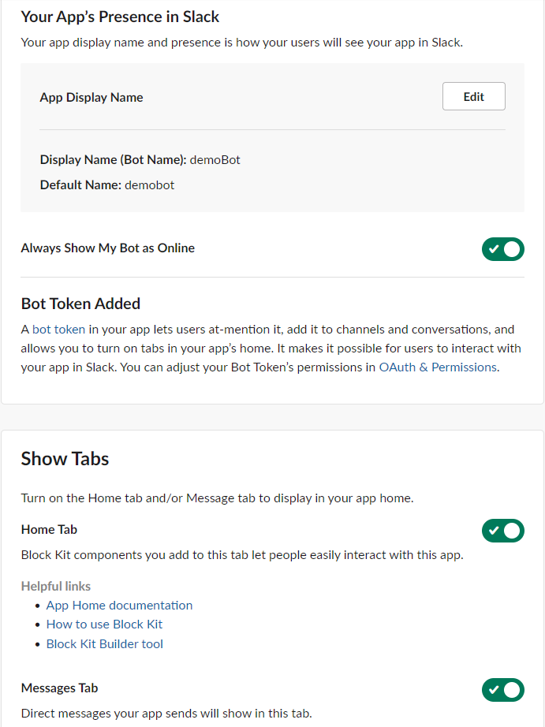
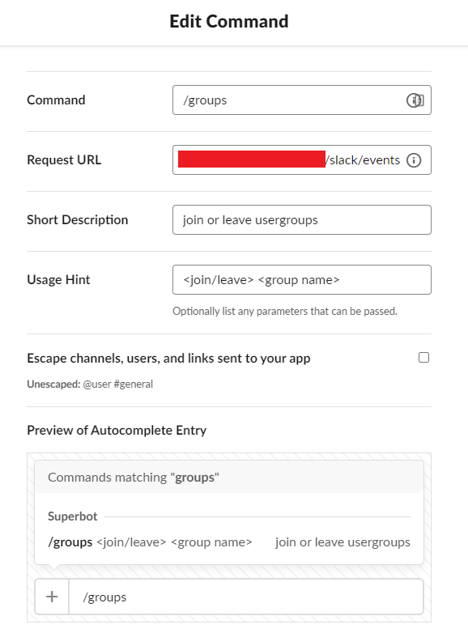

<div id="top"></div>

<!-- TABLE OF CONTENTS -->
<details>
  <summary>Table of Contents</summary>
  <ol>
    <li>
      <a href="#about-the-project">About The Project</a>
    </li>
    <li>
      <a href="#getting-started">Getting Started</a>
      <ul>
        <li><a href="#prerequisites">Prerequisites</a></li>
        <li><a href="#installation">Installation</a></li>
        <li><a href="#setup-bot-on-slacks-website">Setup bot on Slack's website</a></li>
        <li><a href="#running-the-image">Installation</a></li>
      </ul>
    </li>
    <li><a href="#usage">Usage</a></li>
      <ul>
        <li><a href="#commands">Commands</a></li>
      </ul>
    <li><a href="#handlers">Handlers</a></li>
    <li><a href="#technologies">Technologies</a></li>
    <li><a href="#license">License</a></li>
  </ol>
</details>

# Nitor Slack group bot

## About the project

This project is a Slack application that helps users join and leave user groups. The goal of this project was to solve the workplace problem of people being disconnected from each other especially during remote working conditions. With this Slack bot, people with similar interests or knowledge can find each other easier and communicate better.

## Getting started

### Prerequisites

To run the bot locally you need either a Java runtime or Docker installed along with ngrok to ge a tunnel for getting a public url.


## Installation

### Setup bot on Slack's [website](https://api.slack.com/apps)
First create a new app from the link above and give it a name and a workspace where it will be working in.


After creating the bot, scroll down to the App Credentials in **Basic Information.** The Signing Secret is used in the env file.


Then go to the **OAuth & Permissions** tab and scroll down. Add the following permissions for this bot to work.


On the same tab, scroll up to the OAuth Tokens section and press Install to Workspace. Allow all permissions. The Token will be used in the env file.


Next navigate to the **App Home** tab and enable all three settings. You can also change the bot's name here.



Now, run the bot (and ngrok if needed and keep note of the URL) before setting up the rest of the bot functionality.

Got to the **Event Subscriptions** tab and write the URL where your VM is accessible (either the ngrok URL or your own public one) with the **/slack/events** endpoint specified. Then scroll down to **Subscribe to bot events** and add "app_home_opened" and "app_mention" to the bot events.


After that, copy that same URL to the Request URL in **Interactivity & Shortcuts**. You may need to enable Interactivity to see this view.


Then create a new command in the **Slash Commands** tab with the **Create New Command** button.


The command should be **\*/groups\*** and the URL the same as before. The rest of the options don't matter in regards of the bots functionality.



Now just invite the bot to a channel with **@APPNAME** where you want to use it.


### Running the image

The bot needs a SLACK_BOT_TOKEN and SLACK_SIGNING_SECRET as environment variables from your own slack app to run. They can be given in an environment file or as cli parameters.

*Image name for dockerhub hosted image is "hhbot/slackbot:latest". Use the name you assign if you build the image yourself*
*The slackbot runs on port 8080 unless specified otherwise by PORT env variable.*

```bash
# .env
PORT=specified_port # Optional, defaults to 8080
SLACK_BOT_TOKEN=your_token
SLACK_SIGNING_SECRET=your_secret
```

```bash
# run from source
docker build -t NAME .
docker run --env-file .env -p LOCAL_PORT:CONTAINER_PORT NAME

# run from dockerhub image
docker run --env-file .env -p LOCAL_PORT:CONTAINER_PORT hhbot/slackbot:latest

# run with cli env variables
docker run -e PORT=specified_port \
    -e SLACK_BOT_TOKEN=your_token \
    -e SLACK_SIGNING_SECRET=your_secret \
    -p LOCAL_PORT:CONTAINER_PORT \
    hhbot/slackbot:latest
```

<!-- USAGE EXAMPLES -->
## Usage

### Commands

#### Joining / creating the user group: ####
Write the following command in the Slack channel's message input: 
```Slack input
    /groups join [group_name]
```

- If the group exists, and you are not currently in it, you will be added to it successfully
- If the group does not exist, it will be created before you are added to it successfully
- If you already are in the group, you can not join it (the joining will fail)
- If the user group is disabled, it will be enabled again before you are added to it successfully
- If the group's name is similar with other group names, an interactive list will be shown to you:
  - The list contains:
    - All the groups that have similar names with the given group name
    - "Join" buttons, which you can press in order to join any of those similar groups
    - "Create and Join" button, which you can press to create and join the new group

#### Leaving the user group: ####

Write the following command in the Slack channel's message input:
```Slack input
   /groups leave [group_name]
```

- If you are in the group, you will be removed from it successfully
- If the group does not exist, you can not leave it (the removing will fail)
- If you are the only member of the group, it will be disabled after you have left it successfully
- Remember: there will be no interactive list for similar group names when you are trying to leave a group
  - Make sure you write group's name correctly

#### Help message ####

Write the following command in the Slack channel's message input:
```Slack input
   /groups help
```

- The command will show you a help message which contains all the available commands of the bot
- The command is also launched automatically if: 
  - Your join/leave command has failed due to missing parameters
  - You have used a command that does not exist in the bot

## Handlers

``` 
public Response handleUsergroupCommand 
```
- Breaks the command's name and target from user input. Calls finalizeUsergroup
   to finalize the user group method and calls messageUtil to send the correct
   message to the user. 

```
public boolean addUserToGroup
```
- Adds the user into a new user group, if the certain conditions allow it.
- Uses userID to detect the particular user.
- Uses the group object to add the user to wanted usergroup.
- Return true if the user was added to user group successfully. Returns false
  if the user already is in the user group or error accures.

```
public boolean removeUserFromGroup
```
- Removes the user from user group, if certain conditions allow it.
- Uses the same principale as addUserToGroup except instead of joining it removes.

## Technologies

- Java
- Spring Framework
- Slack Bolt API
- Checkstyle linter

<!-- LICENSE -->
## License

Distributed under the MIT License. See `LICENSE.txt` for more information.

<p align="right">(<a href="#top">back to top</a>)</p>
