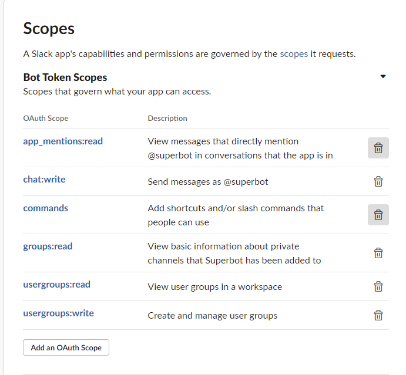

## Setup bot on Slack's [website](https://api.slack.com/apps)
First create a new app from the link above and give it a name and a workspace where it will be working in.


After creating the bot, check the signing secret from the **Basic Information** tab and use it in the env file.


Then go to the **OAuth and Permissions** tab and add the following permissions for this bot to work.



On the same tab, scroll down to view the OAuth token that will be set in the env file


Now, run the bot (and ngrok if needed and keep note of the URL) before setting up the rest of the bot functionality.

Got to the **Event Subscriptions** tab and write the URL where your VM is accessible (either the ngrok URL or your own public one) with the **/slack/events** endpoint specified.


After that, copy that same URL to the Request URL in **Interactivity & Shortcuts**. You may need to enable Interactivity to see this view.


Then create a new command in the **Slash Commands** tab with the **Create New Command** button.


The command should be **\*/groups\*** and the URL the same as before. The rest of the options don't matter in regards of the bots functionality.


Now just invite the bot to a channel with **@APPNAME** where you want to use it.

## Running the bot in a VM
[https://docs.docker.com/engine/install/ubuntu/](https://docs.docker.com/engine/install/ubuntu/)

Run the following commands.

```bash
# clone repo
git clone https://github.com/NitorCreations/slack-group-bot
cd slack-group-bot
docker build . -t bot # replace bot with a name of your choice

# write env
cat <<EOF > .env
PORT=[PORT]
SLACK_BOT_TOKEN=[xoxb-TOKEN...]
SLACK_SIGNING_SECRET=[SECRET]
EOF

# run docker image
docker run -d --env-file .env -p [LOCAL_PORT]:[CONTAINER_PORT] bot

# if not already on public net, run ngrok tunnel
ngrok http [LOCAL_PORT]
```